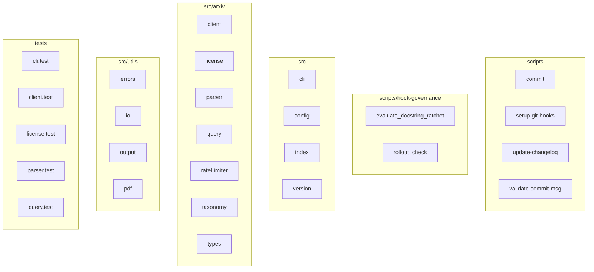
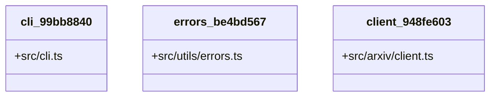
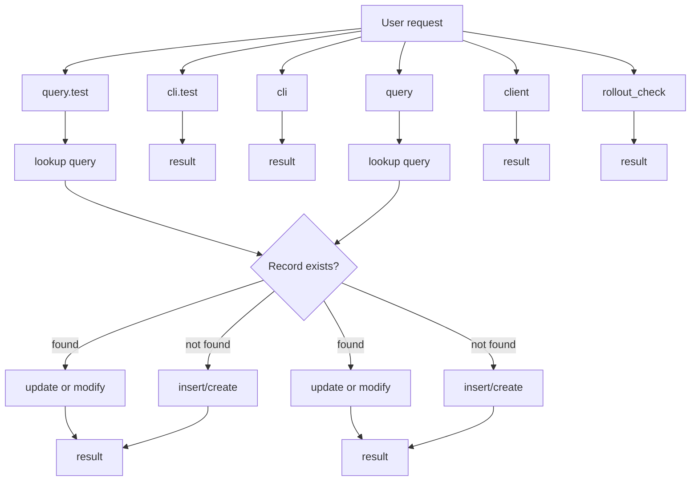
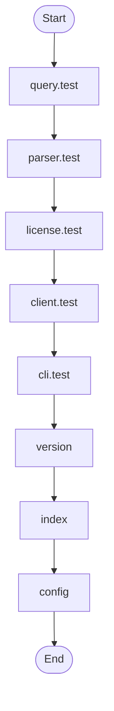
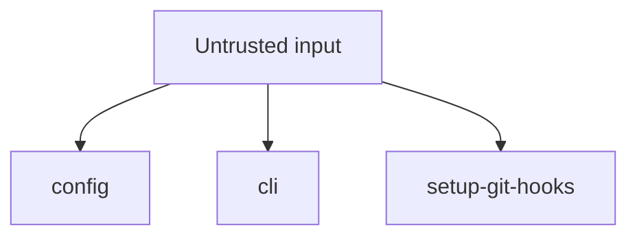
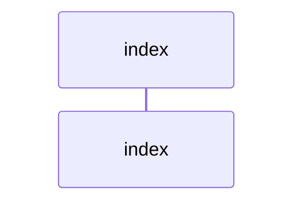
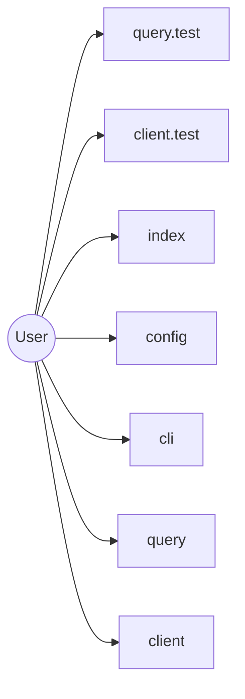

# Diagram Context Pack

Generated: 2026-05-08T15:34:36Z

## architecture

```mermaid
graph TD
  subgraph sg_scripts_16728d18["scripts"]
    node_scripts_commit_7ed92b70["commit"]
    node_scripts_setup_git_hooks_2ed98c53["setup-git-hooks"]
    node_scripts_update_changelog_2da7451c["update-changelog"]
    node_scripts_validate_commit_msg_c49346f6["validate-commit-msg"]
  end
  subgraph sg_scripts_hook_governance_22d136eb["scripts/hook-governance"]
    node_scripts_hook_governance_evaluate_docstring_ratch_407d0d3c["evaluate_docstring_ratchet"]
    node_scripts_hook_governance_rollout_check_7c494353["rollout_check"]
  end
  subgraph sg_src_f27fede2["src"]
    node_src_cli_50037f41["cli"]
    node_src_config_cad1d6da["config"]
    node_src_index_04ad1fb1["index"]
    node_src_version_6148399c["version"]
  end
  subgraph sg_src_arxiv_bba657a0["src/arxiv"]
    node_src_arxiv_client_8fb969a5["client"]
    node_src_arxiv_license_5fc7ec9c["license"]
    node_src_arxiv_parser_233901f3["parser"]
    node_src_arxiv_query_adab05ed["query"]
    node_src_arxiv_ratelimiter_85b2efd8["rateLimiter"]
    node_src_arxiv_taxonomy_ce8b11d2["taxonomy"]
    node_src_arxiv_types_89584dfa["types"]
  end
  subgraph sg_src_utils_e236f4b4["src/utils"]
    node_src_utils_errors_6722e594["errors"]
    node_src_utils_io_e79ec14c["io"]
    node_src_utils_output_38277498["output"]
    node_src_utils_pdf_650439c5["pdf"]
  end
  subgraph sg_tests_04d13fd0["tests"]
    node_tests_cli_test_7d87d79c["cli.test"]
    node_tests_client_test_492a3713["client.test"]
    node_tests_license_test_6bddf6e7["license.test"]
    node_tests_parser_test_7edaf93e["parser.test"]
    node_tests_query_test_61452b15["query.test"]
  end

```

## auth

```mermaid
flowchart TD
  Note["No authentication components found"]

```

## class

```mermaid
classDiagram
  class cli_99bb8840 {
    +src/cli.ts
  }
  class errors_be4bd567 {
    +src/utils/errors.ts
  }
  class client_948fe603 {
    +src/arxiv/client.ts
  }

```

## database

```mermaid
flowchart TD
  UserRequest["User request"]
  Decision{Record exists?}
  query_test_32074ef4["query.test"]
  UserRequest --> query_test_32074ef4
  query_test_32074ef4 --> query_test_32074ef4_lookup["lookup query"]
  query_test_32074ef4_lookup --> Decision
  Decision -->|found| query_test_32074ef4_update["update or modify"]
  Decision -->|not found| query_test_32074ef4_create["insert/create"]
  query_test_32074ef4_update --> query_test_32074ef4_result["result"]
  query_test_32074ef4_create --> query_test_32074ef4_result["result"]
  cli_test_4851f28b["cli.test"]
  UserRequest --> cli_test_4851f28b
  cli_test_4851f28b --> cli_test_4851f28b_result["result"]
  cli_99bb8840["cli"]
  UserRequest --> cli_99bb8840
  cli_99bb8840 --> cli_99bb8840_result["result"]
  query_a8b77192["query"]
  UserRequest --> query_a8b77192
  query_a8b77192 --> query_a8b77192_lookup["lookup query"]
  query_a8b77192_lookup --> Decision
  Decision -->|found| query_a8b77192_update["update or modify"]
  Decision -->|not found| query_a8b77192_create["insert/create"]
  query_a8b77192_update --> query_a8b77192_result["result"]
  query_a8b77192_create --> query_a8b77192_result["result"]
  client_948fe603["client"]
  UserRequest --> client_948fe603
  client_948fe603 --> client_948fe603_result["result"]
  rollout_check_6c0140db["rollout_check"]
  UserRequest --> rollout_check_6c0140db
  rollout_check_6c0140db --> rollout_check_6c0140db_result["result"]
  classDef dbNode fill:#0ea5e9,color:#fff
  classDef decisionNode fill:#0284c7,color:#fff

```

## dependency

```mermaid
graph LR
  ext_future_05a73385["__future__"] --> node_scripts_hook_governance_evaluate_docstring_ratch_407d0d3c
  ext_future_05a73385["__future__"] --> node_scripts_hook_governance_rollout_check_7c494353
  ext_an_de73eac0["an"] --> node_scripts_hook_governance_rollout_check_7c494353
  ext_an_de73eac0["an"] --> node_scripts_hook_governance_rollout_check_7c494353
  ext_argparse_e750ee7c["argparse"] --> node_scripts_hook_governance_evaluate_docstring_ratch_407d0d3c
  ext_argparse_e750ee7c["argparse"] --> node_scripts_hook_governance_rollout_check_7c494353
  ext_cheerio_efb58830["cheerio"] --> node_src_arxiv_taxonomy_ce8b11d2
  ext_child_process_4845fa97["child_process"] --> node_scripts_commit_7ed92b70
  ext_datetime_89ffad08["datetime"] --> node_scripts_hook_governance_evaluate_docstring_ratch_407d0d3c
  ext_datetime_89ffad08["datetime"] --> node_scripts_hook_governance_rollout_check_7c494353
  ext_explicit_a45c2264["explicit"] --> node_scripts_hook_governance_evaluate_docstring_ratch_407d0d3c
  ext_explicit_a45c2264["explicit"] --> node_scripts_hook_governance_evaluate_docstring_ratch_407d0d3c
  ext_fast_xml_parser_20e786e3["fast-xml-parser"] --> node_src_arxiv_parser_233901f3
  ext_fs_3f4bb586["fs"] --> node_scripts_update_changelog_2da7451c
  ext_json_05d97e6e["json"] --> node_scripts_hook_governance_evaluate_docstring_ratch_407d0d3c
  ext_json_05d97e6e["json"] --> node_scripts_hook_governance_rollout_check_7c494353
  ext_node_child_process_f62b7d19["node:child_process"] --> node_src_cli_50037f41
  ext_node_child_process_f62b7d19["node:child_process"] --> node_tests_cli_test_7d87d79c
  ext_node_child_process_f62b7d19["node:child_process"] --> node_scripts_setup_git_hooks_2ed98c53
  ext_node_child_process_f62b7d19["node:child_process"] --> node_scripts_validate_commit_msg_c49346f6
  ext_node_crypto_c7dfc512["node:crypto"] --> node_src_arxiv_client_8fb969a5
  ext_node_fs_a15b7d96["node:fs"] --> node_src_cli_50037f41
  ext_node_fs_a15b7d96["node:fs"] --> node_tests_cli_test_7d87d79c
  ext_node_fs_a15b7d96["node:fs"] --> node_src_arxiv_client_8fb969a5
  ext_node_fs_a15b7d96["node:fs"] --> node_src_arxiv_client_8fb969a5
  ext_node_fs_a15b7d96["node:fs"] --> node_src_arxiv_client_8fb969a5
  ext_node_fs_a15b7d96["node:fs"] --> node_tests_client_test_492a3713
  ext_node_fs_a15b7d96["node:fs"] --> node_scripts_commit_7ed92b70
  ext_node_fs_a15b7d96["node:fs"] --> node_src_config_cad1d6da
  ext_node_fs_a15b7d96["node:fs"] --> node_src_utils_io_e79ec14c
  ext_node_fs_a15b7d96["node:fs"] --> node_scripts_setup_git_hooks_2ed98c53
  ext_node_fs_a15b7d96["node:fs"] --> node_scripts_validate_commit_msg_c49346f6
  ext_node_os_d93fe73a["node:os"] --> node_tests_cli_test_7d87d79c
  ext_node_os_d93fe73a["node:os"] --> node_tests_client_test_492a3713
  ext_node_os_d93fe73a["node:os"] --> node_src_config_cad1d6da
  ext_node_path_78811c13["node:path"] --> node_src_cli_50037f41
  ext_node_path_78811c13["node:path"] --> node_tests_cli_test_7d87d79c
  ext_node_path_78811c13["node:path"] --> node_src_arxiv_client_8fb969a5
  ext_node_path_78811c13["node:path"] --> node_tests_client_test_492a3713
  ext_node_path_78811c13["node:path"] --> node_src_config_cad1d6da
  ext_node_path_78811c13["node:path"] --> node_scripts_setup_git_hooks_2ed98c53
  ext_node_readline_bb6096cc["node:readline"] --> node_src_utils_io_e79ec14c
  ext_node_url_d0cb3ad7["node:url"] --> node_tests_cli_test_7d87d79c
  ext_pathlib_4471f74a["pathlib"] --> node_scripts_hook_governance_evaluate_docstring_ratch_407d0d3c
  ext_pathlib_4471f74a["pathlib"] --> node_scripts_hook_governance_rollout_check_7c494353
  ext_pdf_parse_f770c2a7["pdf-parse"] --> node_src_utils_pdf_650439c5
  ext_readline_2d9e02a8["readline"] --> node_scripts_commit_7ed92b70
  ext_sys_b4c56ee8["sys"] --> node_scripts_hook_governance_evaluate_docstring_ratch_407d0d3c
  ext_sys_b4c56ee8["sys"] --> node_scripts_hook_governance_rollout_check_7c494353
  ext_typing_02d7d347["typing"] --> node_scripts_hook_governance_evaluate_docstring_ratch_407d0d3c
  ext_typing_02d7d347["typing"] --> node_scripts_hook_governance_rollout_check_7c494353
  ext_vitest_4c9cfa13["vitest"] --> node_tests_cli_test_7d87d79c
  ext_vitest_4c9cfa13["vitest"] --> node_tests_client_test_492a3713
  ext_vitest_4c9cfa13["vitest"] --> node_tests_license_test_6bddf6e7
  ext_vitest_4c9cfa13["vitest"] --> node_tests_parser_test_7edaf93e
  ext_vitest_4c9cfa13["vitest"] --> node_tests_query_test_61452b15
  ext_yargs_988f2857["yargs"] --> node_src_cli_50037f41
  ext_yargs_988f2857["yargs"] --> node_src_cli_50037f41
  ext_zod_370c9d47["zod"] --> node_src_config_cad1d6da
  style ext_an_de73eac0 fill:#f59e0b,color:#fff
  style ext_argparse_e750ee7c fill:#f59e0b,color:#fff
  style ext_cheerio_efb58830 fill:#f59e0b,color:#fff
  style ext_child_process_4845fa97 fill:#f59e0b,color:#fff
  style ext_datetime_89ffad08 fill:#f59e0b,color:#fff
  style ext_explicit_a45c2264 fill:#f59e0b,color:#fff
  style ext_fast_xml_parser_20e786e3 fill:#f59e0b,color:#fff
  style ext_fs_3f4bb586 fill:#f59e0b,color:#fff
  style ext_future_05a73385 fill:#f59e0b,color:#fff
  style ext_json_05d97e6e fill:#f59e0b,color:#fff
  style ext_node_child_process_f62b7d19 fill:#f59e0b,color:#fff
  style ext_node_crypto_c7dfc512 fill:#f59e0b,color:#fff
  style ext_node_fs_a15b7d96 fill:#f59e0b,color:#fff
  style ext_node_os_d93fe73a fill:#f59e0b,color:#fff
  style ext_node_path_78811c13 fill:#f59e0b,color:#fff
  style ext_node_readline_bb6096cc fill:#f59e0b,color:#fff
  style ext_node_url_d0cb3ad7 fill:#f59e0b,color:#fff
  style ext_pathlib_4471f74a fill:#f59e0b,color:#fff
  style ext_pdf_parse_f770c2a7 fill:#f59e0b,color:#fff
  style ext_readline_2d9e02a8 fill:#f59e0b,color:#fff
  style ext_sys_b4c56ee8 fill:#f59e0b,color:#fff
  style ext_typing_02d7d347 fill:#f59e0b,color:#fff
  style ext_vitest_4c9cfa13 fill:#f59e0b,color:#fff
  style ext_yargs_988f2857 fill:#f59e0b,color:#fff
  style ext_zod_370c9d47 fill:#f59e0b,color:#fff

```

## events

```mermaid
flowchart TD
  Note["No event/channels components found"]

```

## flow

```mermaid
flowchart TD
  Start(["Start"])
  query_test_32074ef4["query.test"]
  Start --> query_test_32074ef4
  parser_test_3c7414cf["parser.test"]
  query_test_32074ef4 --> parser_test_3c7414cf
  license_test_3c4f0a71["license.test"]
  parser_test_3c7414cf --> license_test_3c4f0a71
  client_test_4b44c0f5["client.test"]
  license_test_3c4f0a71 --> client_test_4b44c0f5
  cli_test_4851f28b["cli.test"]
  client_test_4b44c0f5 --> cli_test_4851f28b
  version_5ca4f385["version"]
  cli_test_4851f28b --> version_5ca4f385
  index_1bc04b52["index"]
  version_5ca4f385 --> index_1bc04b52
  config_b79606fb["config"]
  index_1bc04b52 --> config_b79606fb
  End(["End"])
  config_b79606fb --> End

```

## security

```mermaid
flowchart TD
  Untrusted["Untrusted input"]
  config_b79606fb["config"]
  Untrusted --> config_b79606fb
  cli_99bb8840["cli"]
  Untrusted --> cli_99bb8840
  setup_git_hooks_70750d40["setup-git-hooks"]
  Untrusted --> setup_git_hooks_70750d40
  classDef securityNode fill:#dc2626,color:#fff

```

## sequence

```mermaid
sequenceDiagram
  participant index_1bc04b52 as index

```

## user

```mermaid
flowchart LR
  User(("User"))
  query_test_32074ef4["query.test"]
  User --> query_test_32074ef4
  client_test_4b44c0f5["client.test"]
  User --> client_test_4b44c0f5
  index_1bc04b52["index"]
  User --> index_1bc04b52
  config_b79606fb["config"]
  User --> config_b79606fb
  cli_99bb8840["cli"]
  User --> cli_99bb8840
  query_a8b77192["query"]
  User --> query_a8b77192
  client_948fe603["client"]
  User --> client_948fe603
  classDef userNode fill:#16a34a,color:#fff

```
